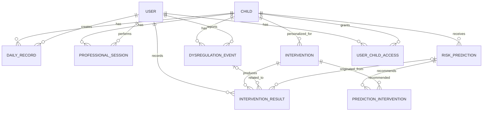

# DATA-03 — Modelo de datos normalizado

A partir de DATA-01 y DATA-02, el modelo debe conservar tres propiedades: **historial longitudinal por niño**, separación entre **datos observados y predicciones**, y trazabilidad de **intervención → resultado**. Esto es consistente con la propuesta de Bluba Anticipa, que combina registros de familia, educación y profesionales, construye una línea base individual y entrega riesgo, confianza, explicación y estrategias preventivas. 

La documentación oficial además exige trabajar con registros cotidianos, observaciones profesionales, historial de crisis y datos potencialmente incompletos para estimar riesgo en las próximas horas o día siguiente. 

## 1. Modelo ER propuesto

Las ocho entidades solicitadas son el núcleo. Agrego **dos tablas auxiliares** indispensables para mantener correctamente relaciones muchos-a-muchos:

* `UserChildAccess`: qué usuario puede acceder a qué niño y bajo qué rol.
* `PredictionIntervention`: qué intervenciones fueron recomendadas para una predicción.

Estas dos tablas son una decisión de diseño backend, no entidades presentes explícitamente en los datos entregados.



La lógica funcional resultante es:

```text
Child
  │
  ├── DailyRecord
  ├── ProfessionalSession
  ├── DysregulationEvent
  │
  └── RiskPrediction
          │
          └── PredictionIntervention
                    │
                    ▼
               Intervention
                    │
                    ▼
            InterventionResult
```

---

# 2. `Child`

Entidad raíz del dominio.

```text
child
────────────────────────────────────────────
id                  UUID PK
external_case_id    VARCHAR UNIQUE NOT NULL
age_range           VARCHAR NULL
primary_diagnosis   VARCHAR NULL
sensory_profile     TEXT NULL
created_at          TIMESTAMPTZ NOT NULL
updated_at          TIMESTAMPTZ NOT NULL
```

### Ejemplo

```text
id                = UUID(...)
external_case_id  = PAC-002
age_range          = 6-7 años
primary_diagnosis = TEA
sensory_profile    = Hipersensible Auditivo y Evitador Táctil
```

`external_case_id` permite conservar identificadores como:

```text
PAC-001
PAC-002
PAC-003
PAC-004
```

sin utilizarlos como claves internas.

### Nota

`primary_diagnosis` y `age_range` se mantienen como metadata aunque DATA-02 decidió no utilizarlos inicialmente en el predictor.

---

# 3. `User`

Representa a cualquier persona que interactúa con Bluba.

```text
user
────────────────────────────────────────────
id                  UUID PK
name                VARCHAR NOT NULL
email               VARCHAR UNIQUE NULL
is_active           BOOLEAN NOT NULL DEFAULT true
created_at          TIMESTAMPTZ NOT NULL
updated_at          TIMESTAMPTZ NOT NULL
```

No pondría directamente:

```text
user.role
```

como único rol global, porque una persona podría tener relaciones diferentes con distintos niños.

Por ejemplo:

```text
Usuario X
 ├─ Familiar de Child A
 └─ Profesional de Child B
```

Para eso utilizamos `UserChildAccess`.

---

# 4. `UserChildAccess`

Tabla auxiliar.

```text
user_child_access
────────────────────────────────────────────
id                  UUID PK
user_id             UUID FK → user.id
child_id            UUID FK → child.id
role                 ENUM
access_level         ENUM
created_at           TIMESTAMPTZ NOT NULL

UNIQUE(user_id, child_id, role)
```

### `role`

```text
FAMILY
EDUCATION
PROFESSIONAL
ADMIN
```

### `access_level`

Podría comenzar simplemente con:

```text
READ
WRITE
MANAGE
```

Esto permite posteriormente implementar correctamente las tres interfaces propuestas.

```text
Familia
Educación
Profesional
```

y restringir información según contexto.

---

# 5. `DailyRecord`

Es la principal fuente longitudinal del motor predictivo.

```text
daily_record
────────────────────────────────────────────
id                       UUID PK
child_id                 UUID FK → child.id
recorded_by_user_id      UUID FK → user.id

record_date              DATE NOT NULL
recorded_at              TIMESTAMPTZ NOT NULL
source_context           ENUM NOT NULL

sleep_quality            ENUM NULL
sleep_hours              DECIMAL(4,2) NULL
wake_state               ENUM NULL
regulation_level         ENUM NULL
routine_change           BOOLEAN NULL
gastrointestinal_status  ENUM NULL
observed_behavior        TEXT NULL
exceptional_event        BOOLEAN NULL
notes                     TEXT NULL

created_at               TIMESTAMPTZ NOT NULL
updated_at               TIMESTAMPTZ NOT NULL
```

### `source_context`

```text
FAMILY
EDUCATION
PROFESSIONAL
```

### Variables DATA-02

| DATA-02                | Campo                     |
| ---------------------- | ------------------------- |
| Calidad sueño          | `sleep_quality`           |
| Horas sueño            | `sleep_hours`             |
| Estado despertar       | `wake_state`              |
| Nivel regulación       | `regulation_level`        |
| Cambio rutina          | `routine_change`          |
| Salud gastrointestinal | `gastrointestinal_status` |
| Comportamiento         | `observed_behavior`       |
| Evento excepcional     | `exceptional_event`       |

### Valores desconocidos

Especialmente importante:

```text
gastrointestinal_status = NULL
```

significa:

> No existe información.

No:

> Estado gastrointestinal normal.

El mismo principio aplica al resto de variables.

---

# 6. `ProfessionalSession`

Representa las sesiones terapéuticas/profesionales.

```text
professional_session
────────────────────────────────────────────
id                       UUID PK
child_id                 UUID FK → child.id
professional_user_id     UUID FK → user.id

session_at               TIMESTAMPTZ NOT NULL
profession               VARCHAR NOT NULL
attendance_status        VARCHAR NULL

initial_alert_level      ENUM NULL
final_alert_level        ENUM NULL

activities               TEXT NULL
professional_notes       TEXT NULL

created_at               TIMESTAMPTZ NOT NULL
updated_at               TIMESTAMPTZ NOT NULL
```

Esto normaliza directamente:

```text
fecha_sesion
profesion
estado_asistencia
nivel_alerta_inicial
nivel_alerta_final
actividades_realizadas
observaciones_profesional
```

del dataset original.

### Importante

No agregaría:

```text
objective_id
```

todavía.

DATA-01 mostró que los CSV entregados **no permiten vincular inequívocamente una sesión profesional con un objetivo terapéutico concreto**.

Podrá incorporarse cuando Bluba entregue dicha relación.

---

# 7. `DysregulationEvent`

Entidad que representa una desregulación real registrada.

Es además la fuente principal para construir el **target de entrenamiento**.

```text
dysregulation_event
────────────────────────────────────────────
id                       UUID PK
child_id                 UUID FK → child.id
reported_by_user_id      UUID FK → user.id NULL

occurred_at              TIMESTAMPTZ NOT NULL
event_type               VARCHAR NOT NULL
intensity_level          ENUM NULL

trigger_description      TEXT NULL
notes                     TEXT NULL

created_at               TIMESTAMPTZ NOT NULL
updated_at               TIMESTAMPTZ NOT NULL
```

### Intensidad

```text
MILD
MODERATE
SEVERE
```

Correspondientes inicialmente a:

```text
Leve (1-3)
Moderada (4-7)
Severa (8-10)
```

---

## Normalización importante respecto del CSV

El archivo original tiene:

```text
detonante_gatillante
estrategia_calma_aplicada
resultado_estrategia
```

No dejaría todo dentro de `DysregulationEvent`.

Lo normalizamos:

```text
detonante_gatillante
        ↓
DysregulationEvent.trigger_description


estrategia_calma_aplicada
        ↓
Intervention


resultado_estrategia
        ↓
InterventionResult
```

Queda así:

```text
DysregulationEvent
        │
        ▼
InterventionResult
        │
        ▼
Intervention
```

Esto permite que **un mismo evento pueda tener múltiples estrategias aplicadas**, algo que el CSV actual no representa bien.

---

# 8. `RiskPrediction`

Entidad central del módulo Bluba Anticipa.

```text
risk_prediction
────────────────────────────────────────────
id                       UUID PK
child_id                 UUID FK → child.id

prediction_at            TIMESTAMPTZ NOT NULL
window_end_at            TIMESTAMPTZ NOT NULL
horizon_hours            SMALLINT NOT NULL DEFAULT 24

risk_score               DECIMAL(5,4) NULL
risk_level               ENUM NOT NULL

confidence_score         DECIMAL(5,4) NULL
confidence_level         ENUM NOT NULL

data_completeness        DECIMAL(5,4) NULL

model_version            VARCHAR NOT NULL
explanation              TEXT NULL

created_at               TIMESTAMPTZ NOT NULL
```

Ejemplo:

```text
prediction_at     = 2026-07-17 20:00
window_end_at     = 2026-07-18 20:00

risk_score        = 0.76
risk_level        = HIGH

confidence_score  = 0.68
confidence_level  = MEDIUM

model_version     = hybrid-mvp-v1
```

La separación entre riesgo y confianza es deliberada: Bluba Anticipa establece que una señal puede ser preocupante aun cuando la información disponible no permita una predicción igualmente confiable. 

---

# 9. Regla temporal de `RiskPrediction`

Esta restricción es crítica.

Para una predicción generada en:

```text
prediction_at = T
```

el motor solo puede utilizar:

```text
dato.observed_at <= T
```

Nunca:

```text
dato.observed_at > T
```

Por ejemplo:

```text
08:00 predicción
     │
     ├──── datos válidos anteriores
     │
     ▼
11:00 ocurre desregulación
```

La desregulación de las 11:00 puede utilizarse después para saber si la predicción fue correcta, pero **jamás como input de la predicción de las 08:00**.

---

# 10. Target derivado

No necesitamos guardar:

```text
desregulacion_proximas_24h
```

como columna permanente dentro de `RiskPrediction`.

Se puede obtener mediante:

```sql
EXISTS (
    SELECT 1
    FROM dysregulation_event e
    WHERE e.child_id = risk_prediction.child_id
      AND e.occurred_at > risk_prediction.prediction_at
      AND e.occurred_at <= risk_prediction.window_end_at
)
```

Resultado:

```text
true  → ocurrió una desregulación
false → no ocurrió
```

Esto evita duplicar información.

---

# 11. `Intervention`

Representa una estrategia preventiva o regulatoria.

```text
intervention
────────────────────────────────────────────
id                       UUID PK

child_id                 UUID FK → child.id NULL
created_by_user_id       UUID FK → user.id NULL

name                     VARCHAR NOT NULL
description              TEXT NOT NULL
category                 VARCHAR NULL

source_type              ENUM NOT NULL
is_active                BOOLEAN NOT NULL DEFAULT true

created_at               TIMESTAMPTZ NOT NULL
updated_at               TIMESTAMPTZ NOT NULL
```

### `source_type`

```text
PROFESSIONAL
HISTORICAL
VALIDATED_CATALOG
```

Ejemplos:

```text
Anticipar transición mediante apoyo visual

Salida temporal a ambiente de baja estimulación

Reducir estímulos auditivos

Pausa regulatoria
```

`child_id = NULL` permite una estrategia general:

```text
catálogo validado
```

Mientras:

```text
child_id = UUID(PAC-002)
```

representa una estrategia personalizada.

Esto implementa la idea del proyecto de priorizar estrategias profesionales e históricamente útiles antes que permitir que un LLM invente intervenciones. 

---

# 12. `PredictionIntervention`

Tabla auxiliar para recomendaciones.

Una predicción puede recomendar varias intervenciones y una intervención puede aparecer en muchas predicciones:

```text
N:M
```

Por tanto:

```text
prediction_intervention
────────────────────────────────────────────
risk_prediction_id       UUID FK
intervention_id          UUID FK

priority                 SMALLINT NULL
reason                   TEXT NULL

PRIMARY KEY (
  risk_prediction_id,
  intervention_id
)
```

Ejemplo:

```text
Prediction #451
│
├── Apoyo visual               priority 1
├── Reducir estímulos          priority 2
└── Espacio de regulación      priority 3
```

---

# 13. `InterventionResult`

Esta entidad registra qué pasó **cuando una estrategia se aplicó realmente**.

```text
intervention_result
────────────────────────────────────────────
id                       UUID PK

child_id                 UUID FK → child.id
intervention_id          UUID FK → intervention.id
recorded_by_user_id      UUID FK → user.id

risk_prediction_id       UUID FK → risk_prediction.id NULL
dysregulation_event_id   UUID FK → dysregulation_event.id NULL

applied_at               TIMESTAMPTZ NOT NULL

outcome                  ENUM NOT NULL
notes                     TEXT NULL

created_at               TIMESTAMPTZ NOT NULL
```

### `outcome`

```text
EFFECTIVE
PARTIALLY_EFFECTIVE
NO_EFFECT
UNKNOWN
```

Ejemplo:

```text
Intervention:
Salida a espacio de menor estimulación

Result:
EFFECTIVE
```

---

# 14. Por qué `InterventionResult` puede estar asociado a predicción o evento

Tenemos dos escenarios.

### Intervención preventiva

```text
RiskPrediction
      ↓
Riesgo alto
      ↓
Intervention
      ↓
Se aplica antes de la crisis
      ↓
InterventionResult
```

Puede ocurrir que **no exista ninguna crisis posteriormente**.

Por ello:

```text
risk_prediction_id = X
dysregulation_event_id = NULL
```

es válido.

### Intervención durante una desregulación

```text
DysregulationEvent
       ↓
Intervention
       ↓
InterventionResult
```

Entonces:

```text
risk_prediction_id     = NULL o X
dysregulation_event_id = Y
```

También es válido.

Esto permite construir la **memoria de intervenciones** descrita en la propuesta: aprender qué estrategias funcionaron previamente para un niño en situaciones similares. 

---

# 15. Schema relacional completo

```text
CHILD
 ├─ id PK
 ├─ external_case_id UNIQUE
 ├─ age_range
 ├─ primary_diagnosis
 └─ sensory_profile


USER
 ├─ id PK
 ├─ name
 └─ email


USER_CHILD_ACCESS
 ├─ user_id FK → USER
 ├─ child_id FK → CHILD
 ├─ role
 └─ access_level


DAILY_RECORD
 ├─ id PK
 ├─ child_id FK → CHILD
 ├─ recorded_by_user_id FK → USER
 ├─ record_date
 ├─ sleep_quality
 ├─ sleep_hours
 ├─ wake_state
 ├─ regulation_level
 ├─ routine_change
 ├─ gastrointestinal_status
 ├─ observed_behavior
 └─ exceptional_event


PROFESSIONAL_SESSION
 ├─ id PK
 ├─ child_id FK → CHILD
 ├─ professional_user_id FK → USER
 ├─ session_at
 ├─ profession
 ├─ initial_alert_level
 ├─ final_alert_level
 ├─ activities
 └─ professional_notes


DYSREGULATION_EVENT
 ├─ id PK
 ├─ child_id FK → CHILD
 ├─ reported_by_user_id FK → USER
 ├─ occurred_at
 ├─ event_type
 ├─ intensity_level
 └─ trigger_description


RISK_PREDICTION
 ├─ id PK
 ├─ child_id FK → CHILD
 ├─ prediction_at
 ├─ window_end_at
 ├─ horizon_hours
 ├─ risk_score
 ├─ risk_level
 ├─ confidence_score
 ├─ confidence_level
 ├─ data_completeness
 ├─ model_version
 └─ explanation


INTERVENTION
 ├─ id PK
 ├─ child_id FK → CHILD NULL
 ├─ created_by_user_id FK → USER
 ├─ name
 ├─ description
 ├─ category
 └─ source_type


PREDICTION_INTERVENTION
 ├─ risk_prediction_id FK
 ├─ intervention_id FK
 ├─ priority
 └─ reason


INTERVENTION_RESULT
 ├─ id PK
 ├─ child_id FK → CHILD
 ├─ intervention_id FK → INTERVENTION
 ├─ recorded_by_user_id FK → USER
 ├─ risk_prediction_id FK → RISK_PREDICTION NULL
 ├─ dysregulation_event_id FK → DYSREGULATION_EVENT NULL
 ├─ applied_at
 ├─ outcome
 └─ notes
```

# 16. Índices mínimos

Para el motor temporal son importantes desde el principio:

```sql
CREATE INDEX idx_daily_record_child_date
ON daily_record(child_id, record_date DESC);

CREATE INDEX idx_session_child_time
ON professional_session(child_id, session_at DESC);

CREATE INDEX idx_event_child_time
ON dysregulation_event(child_id, occurred_at DESC);

CREATE INDEX idx_prediction_child_time
ON risk_prediction(child_id, prediction_at DESC);

CREATE INDEX idx_intervention_result_child_time
ON intervention_result(child_id, applied_at DESC);
```

Con estos índices, consultas como:

```text
últimos 3 días
últimos 7 días
baseline de 14 días
último evento
última sesión
predicciones anteriores
estrategias que funcionaron
```

son directas.

---

# 17. Flujo completo soportado por el modelo

```text
                 CHILD
                   │
       ┌───────────┼─────────────┐
       ▼           ▼             ▼
 DailyRecord   Professional   Dysregulation
                 Session         Event
       │           │             │
       └───────────┼─────────────┘
                   ▼
            Feature Engine
                   │
                   ▼
            RiskPrediction
             │           │
          riesgo      confianza
             │
             ▼
   PredictionIntervention
             │
             ▼
         Intervention
             │
        usuario aplica
             │
             ▼
     InterventionResult
             │
             ▼
       nuevo historial
             │
             └────────────→ futuras predicciones
```

Esto implementa el ciclo conceptual del proyecto:

```text
OBSERVAR
   ↓
PREDECIR
   ↓
INTERVENIR
   ↓
REGISTRAR RESULTADO
   ↓
APRENDER
```

---

## Decisión de DATA-03

Para el MVP utilizaría **PostgreSQL** con estas **8 entidades de dominio**:

```text
Child
User
DailyRecord
ProfessionalSession
DysregulationEvent
RiskPrediction
Intervention
InterventionResult
```

y dos relaciones normalizadas adicionales:

```text
UserChildAccess
PredictionIntervention
```

La clave de diseño es mantener `DysregulationEvent`, `RiskPrediction` e `InterventionResult` separados. Un evento es **algo que ocurrió**, una predicción es **algo que el sistema estimó antes de que ocurriera**, y un resultado de intervención es **la evidencia posterior de qué estrategia se aplicó y cómo funcionó**. Esta separación deja el backend preparado tanto para la demo de NeuroHack como para una futura recolección longitudinal real.
